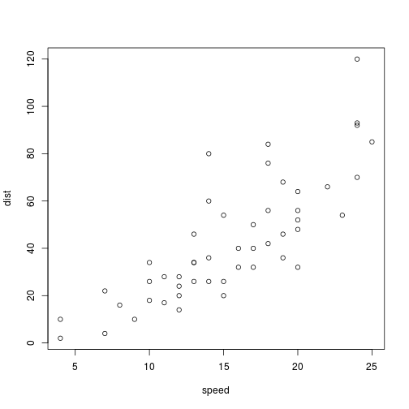

Course Product
========================================================
author: Vishal Prem
autosize: true

Coumpound Interest
========================================================


The addition of interest to the principal sum of a loan or deposit is called compounding. Compound interest is interest on interest. It is the result of reinvesting interest, rather than paying it out, so that interest in the next period is then earned on the principal sum plus previously-accumulated interest. Compound interest is standard in finance and economics.


The Formula
========================================================


```r
P<-1000           #Principal Amount
R<-2              #Rate Of Interest
T<-10             #Time In Years
CI<-P*(1+R/100)^T
print(CI)
```

```
[1] 1218.994
```

Slide With Plot
========================================================


